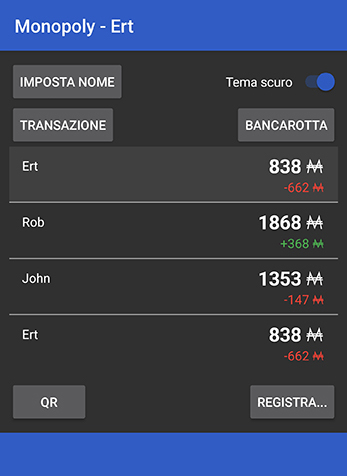

# Monopoly Credit Cards
Play Monopoly with physical credit cards, with QRs and NFC tags\
Each player will run the client application, which connects to a server backend. Only one game can be played at a time.

## Credit card preparation
A credit card has two printed sides, and optionally contains an NFC tag
### Front side
Reference art is available in the `Art` folder, or you can create your own.
### Back side
Generate a QR code for each credit card
QR inputs must be created with `openssl_encrypt($qr,"AES-128-CBC",QR_PASSWORD)`.\
`$qr` can be any value, as long as no two QRs have the same.\
`QR_PASSWORD` must be the same as the one set in `Server/api.php`\
You can also use the example QRs in the `Art` folder. They have been generated with texts from `1` to `7` and password `MonopolyQR`.
### NFC tags
Write a different string in every NFC tag. That's it. Unlike with QRs, there's no password or anything, because.

## Server
The server handles the current active session for all clients.\
Provision a standard PHP server and copy the contents of the `Server` folder to the root.\
If needed, change the defines in `api.php`

## Application
Decide the password that the admin will use to log in 
Fill in the `CHANGE_ME` variables in `Client/app/src/main/java/com/example/ric00/monopoly/MainActivity.java`.\
`pswHash` is a standard bcrypt hash of the password you want to use.\
`serverUrl` is the URL where you deployed the server.\
Build the application

## How to play
One player needs to be the admin. Click in the top right corner of the window and insert the password that you set while building the application.\
Then, associate a credit card's QR and NFC tag to each player.\
The rest of the functions are pretty self-explanatory: QR scans the QR of someone's card and scanning it with NFC will read it as well.\
Bank transactions can be executed by the admin with the provided button, as well as setting a player as bankrupt.

## Disclaimer
If you really want to use this, keep in mind that this is a mostly untested project made in 2018. I fixed it to compile when uploading it to this repo but no warranties.

**Don't scan your own card**